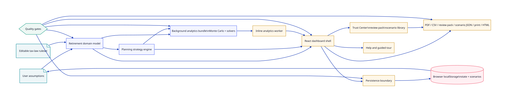
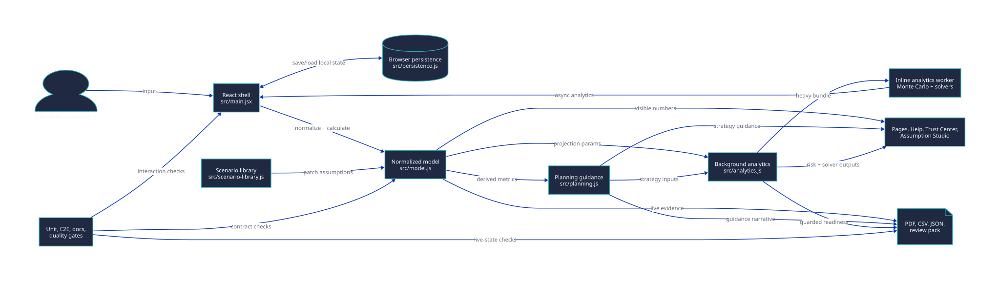
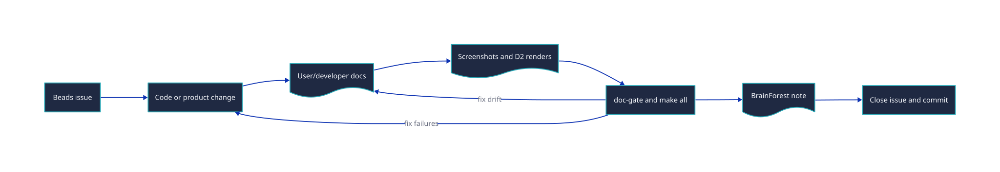

# Developer Documentation

> Use this library to understand, modify, verify, and release the Retirement Corpus & Income Planner.

This documentation is written for contributors, maintainers, and audit reviewers. The product is a local-first React/Vite SPA with pure planning logic, local browser persistence, in-product help, and single-file distributable artifacts.

## 0. TL;DR

| Need | Start Here |
|------|------------|
| Set up the repo | [Developer Bootstrap](bootstrap.md) |
| Understand the source tree | [Developer Architecture](architecture.md) |
| Understand model and tax contracts | [Model and Planning Contract](model-contract.md) |
| Understand persistence and privacy | [Persistence and Privacy Contract](persistence-and-privacy.md) |
| Understand PDF/CSV/JSON output | [Export Pipeline](export-pipeline.md) |
| Run quality gates | [Testing and Quality Gates](testing-and-quality-gates.md) |
| Maintain docs, screenshots, and diagrams | [Documentation Workflow](documentation-workflow.md) |
| Release locally | [Local Release Runbook](runbooks/local-release.md) |
| Check public surface | [Public Surface Map](public-surface.md) |
| Review design rules | [UI Design System](ui/design-system.md), [IA Contract](ui/ia-contract.md) |
| Read design decisions | [ADR Index](adr/README.md) |

## 1. Contributor Architecture

The source has three core boundaries:

- Domain model: calculations, tax, risk, solvers, formatters.
- Planning guidance: strategy scoring, household plan, withdrawal policy, tax-optimization guidance.
- Application shell: React views, charts, persistence orchestration, exports, help, and guided tour.

## 2. Data Flow

All visible numbers should flow from normalized state through the same model functions. If a page, drawer, export, help topic, or table speaks a different number, it is a defect.

## 3. Documentation Quality Loop

Docs are not release garnish. Behaviour changes require docs, screenshots when the UI changes, D2 diagram updates when architecture changes, and gate evidence before the issue closes.

## 4. Public And Private Boundaries

`docs/user` and `docs/developer` are public-facing repository docs. `docs/internal` stores internal audits, waivers, planning records, and closeout evidence. User docs must not depend on internal-only files. Developer docs may point to internal governance where the contributor is expected to have repo access.

## Revision History

| Version | Revision | Date | Change |
|---------|----------|------|--------|
| 1.0.0 | 1 | 2026-05-15 | Added developer documentation index with onboarding map, architecture diagrams, data-flow diagram, and documentation quality loop. |
