# UI Design System

> Design-system contract for the dashboard, Help, tour, modals, exports, and responsive surfaces.

## 0. TL;DR

Tokens live in `src/styles.css`. Components consume tokens, not ad-hoc colours or spacing. Every interactive surface needs visible states, keyboard usability, accessible names, reduced-motion behaviour, and responsive proof.

## 1. Design Token Contract

The token source is `src/styles.css`. Tokens live in `:root` and `[data-theme="dark"]`. The gate is `make ui-tokens`.

Required token families:

| Family | Examples |
|--------|----------|
| Surface | `--bg`, `--bg-2`, `--rail`, `--panel`, `--panel-2`, `--panel-3` |
| Text | `--text`, `--muted`, `--soft` |
| Structure | `--line`, `--line-strong`, `--grid`, `--mesh-line` |
| Semantic | `--success`, `--warning`, `--danger`, `--income`, `--tax`, `--growth`, `--risk` |
| Material | `--glass-edge`, `--surface-glow`, `--shadow`, `--soft-shadow` |
| Motion | transition durations and easing values |
| Density | spacing rhythm for compact, comfortable, and wide layouts |

## 2. Visual Language

The product uses a modern SaaS dashboard language: compact finance typography, glass-like panels, clear hierarchy, dense but breathable layouts, and chart-first evidence. The design should feel professional, not decorative. It should never look like a static spreadsheet wrapped in cards.

## 3. Component State Contract

Every interactive component must define:

- Default.
- Hover.
- Focus-visible.
- Active/pressed.
- Selected.
- Disabled.
- Loading or calculating when applicable.
- Error or warning when applicable.
- Reduced-motion equivalent.

### 3.1 Per-Component State Machine Diagrams

Canonical state-machine diagrams for every interactive component are in
`docs/developer/ui/state-machines/`. Each diagram shows applicable states as nodes
and transitions as labeled edges. D2 source (`.d2`) and rendered PNG/SVG are committed
together so reviewers without d2 installed can view the diagrams.

| # | Component | Renderer (src/main.jsx) | State diagram | Source |
|---|-----------|------------------------|---------------|--------|
| 01 | StatCard | line 939 | 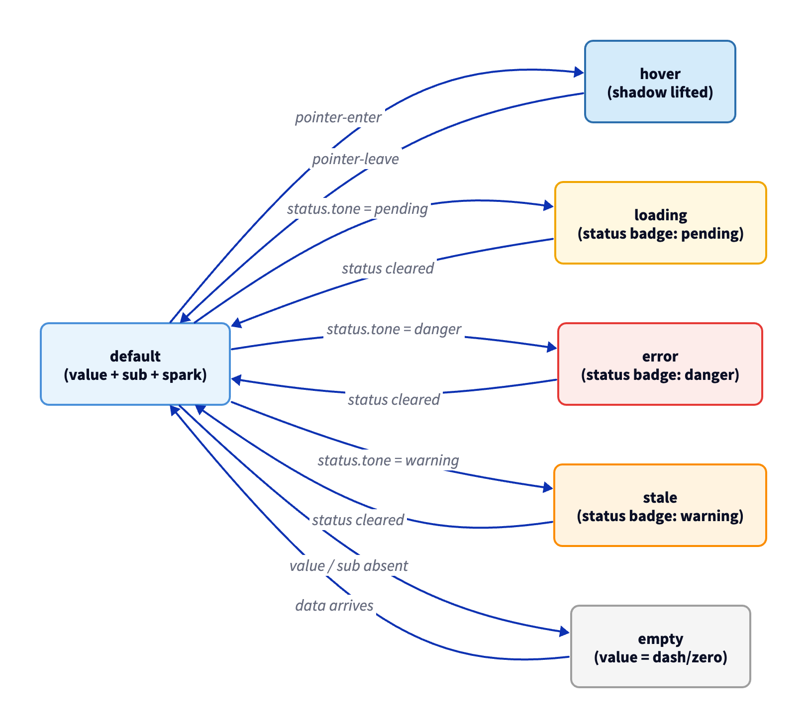 | [01-statcard.d2](state-machines/01-statcard.d2) |
| 02 | GaugeCard | line 954 | 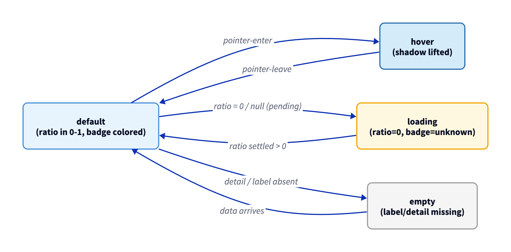 | [02-gaugecard.d2](state-machines/02-gaugecard.d2) |
| 03 | NumberEntry | line 970 | 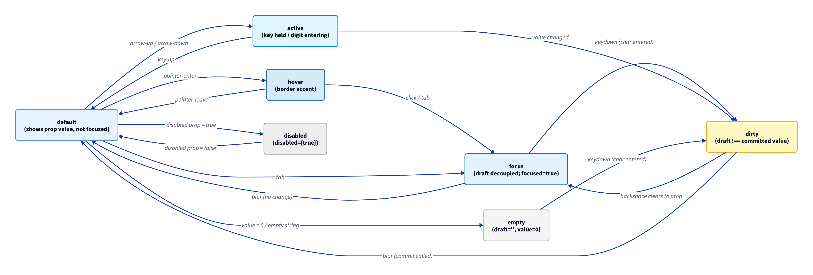 | [03-numberentry.d2](state-machines/03-numberentry.d2) |
| 04 | Control | line 1029 | 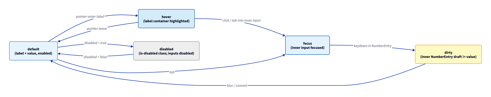 | [04-control.d2](state-machines/04-control.d2) |
| 05 | BrandedToast | line 549 | 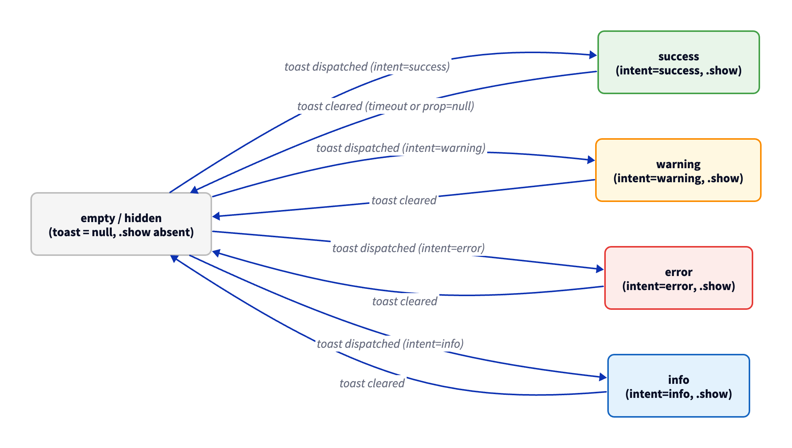 | [05-brandedtoast.d2](state-machines/05-brandedtoast.d2) |
| 06 | ChoiceGroup | line 1259 | 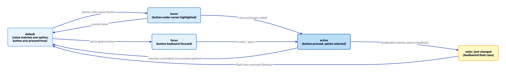 | [06-choicegroup.d2](state-machines/06-choicegroup.d2) |
| 07 | TrustNotice | line 1328 | 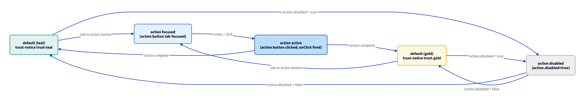 | [07-trustnotice.d2](state-machines/07-trustnotice.d2) |
| 08 | PanelHead | line 6357 | 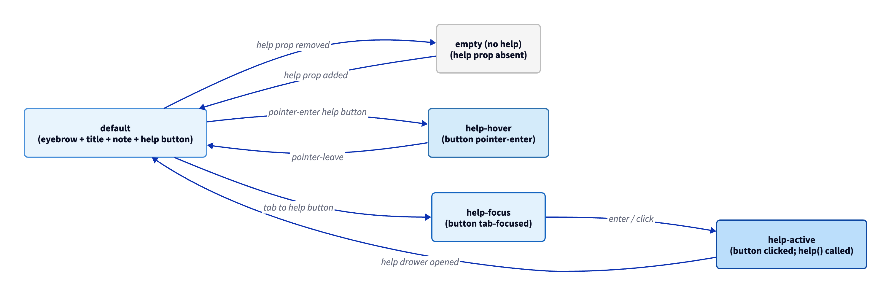 | [08-panelhead.d2](state-machines/08-panelhead.d2) |
| 09 | MiniMetric | line 6370 | 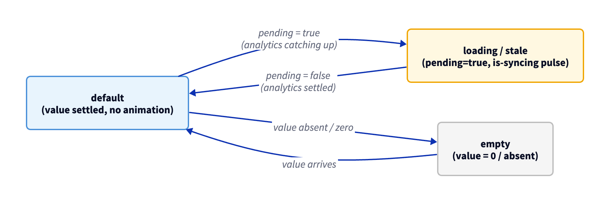 | [09-minimetric.d2](state-machines/09-minimetric.d2) |
| 10 | LegendRows | line 6381 | 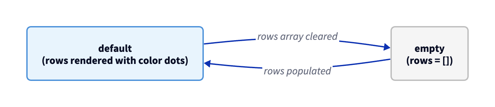 | [10-legendrows.d2](state-machines/10-legendrows.d2) |
| 11 | StatementRow | line 6385 | 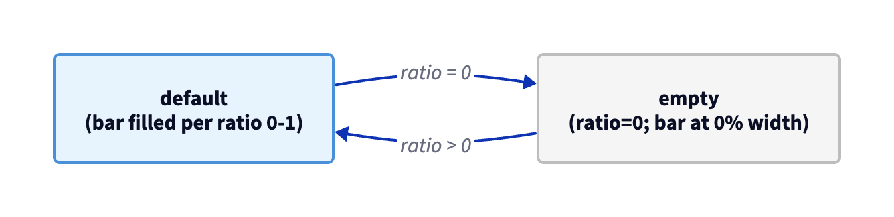 | [11-statementrow.d2](state-machines/11-statementrow.d2) |
| 12 | AnalyticsPendingNotice | line 1247 | 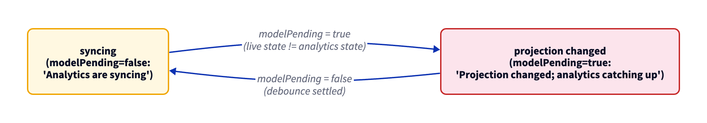 | [12-analyticspendingnotice.d2](state-machines/12-analyticspendingnotice.d2) |
| 13 | QuickField | line 1220 | 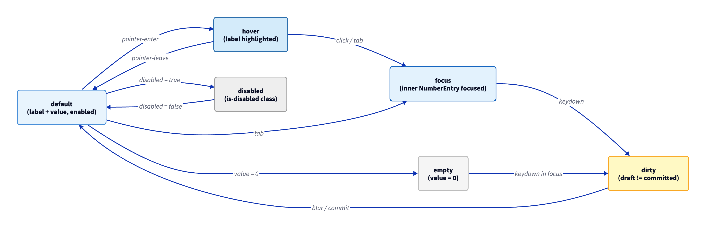 | [13-quickfield.d2](state-machines/13-quickfield.d2) |
| 14 | QuickSelect | line 1233 | 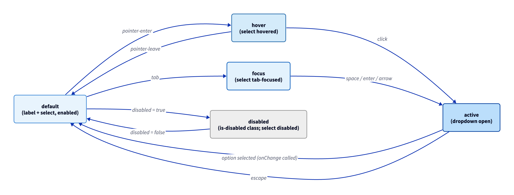 | [14-quickselect.d2](state-machines/14-quickselect.d2) |
| 15 | DisclaimerNotice | line 2343 | 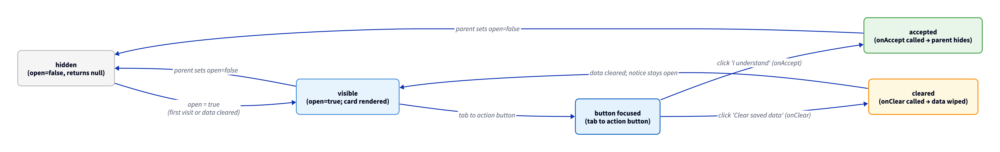 | [15-disclaimernotice.d2](state-machines/15-disclaimernotice.d2) |
| 16 | TaxLawEditor | line 1058 | 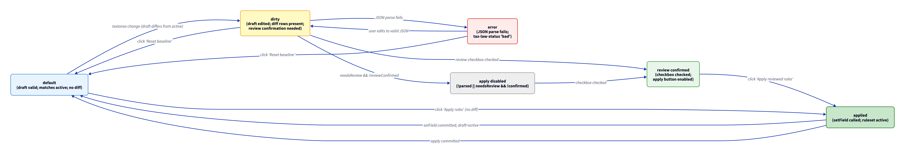 | [16-taxlaweditor.d2](state-machines/16-taxlaweditor.d2) |

**Cross-check findings (R4.6):** The components `ScenarioChip` and `TaxSlabRow` named in the
audit brief do not exist anywhere in `src/`. Beads issue filed: see `fin-c96` epic for tracking.
State machine diagrams are based on the 16 components that are confirmed present in `src/main.jsx`.

## 4. Accessibility

The UI targets WCAG 2.2 AA. Automated coverage is split across `make test-a11y`, `make ui-contrast`, layout regression, and semantic E2E checks. Reduced motion is handled by `prefers-reduced-motion`; forced colors are handled by `forced-colors: active`.

## 5. Motion

Motion must signal state. Toasts, guided tour, hover lifts, progress fills, model status, selection changes, and feedback highlights should help the user understand that the product responded.

Reduced motion users must receive non-motion feedback.

## 5a. Easing-Curve Catalogue

Per UI-UX §27.7 (K-UI-UX-R31, ANSWERED 2026-05-18), this catalogue is the named, reviewable easing-curve artifact required at design-review gate. Curves are sourced from `src/styles.css` (read-only audit; do not modify `src/` based on this section). The catalogue is a documentation artifact — the source of truth for values is the CSS; the catalogue must be kept in sync whenever a curve changes.

| Token name | Cubic-bezier (x1, y1, x2, y2) | Intended use | Where used in `src/styles.css` |
|---|---|---|---|
| `--ease-standard` (CSS `ease`) | `cubic-bezier(0.25, 0.1, 0.25, 1)` | Button hover / active, form field state, interactive element lift/border/shadow transitions. General-purpose state transition for UI control responsiveness. | ~30+ `transition:` declarations on buttons, inputs, toggles, rail items, selects, nav elements, accordion headers, and column resize handles |
| `--ease-in-out-standard` (CSS `ease-in-out`) | `cubic-bezier(0.42, 0, 0.58, 1)` | Looping pulse animations where the rhythm should feel symmetric. Not for enter/exit. | `modelPulse` animation (180ms, 780ms, 920ms variants); `tourSpotlightPulse` animation (1600ms) |
| `--ease-out-bounce` | `cubic-bezier(0.2, 0.8, 0.2, 1)` | Page lift / surface enter animations and mobile context-reveal transitions. Decelerating enter: fast start, soft landing. | `pageLift` keyframe (360ms, `src/styles.css:860`); mobile context menu reveal (200ms, `src/styles.css:7475`) |
| `--ease-orbit` | `cubic-bezier(0.55, 0, 0.2, 1)` | Long-duration loading orbit sweep. Slow accelerate → fast middle → quick decelerate; conveys continuous progress without abrupt restarts. | `orbitSweep` keyframe (6500ms, `src/styles.css:921`) |
| `--ease-expo-out` | `cubic-bezier(0.19, 1, 0.22, 1)` | Modal / panel / overlay / coach-card enter. Exponential deceleration: instant feel at start, near-zero velocity at end. Used for all surfaces that appear in response to user intent (must feel immediate). | `panelLift` (220ms, `src/styles.css:5180`); `privacyConsentEnter` (260ms, `src/styles.css:4753`); `tourEnter` (260ms, `src/styles.css:5761`); help drawer slide (220ms + opacity 180ms, `src/styles.css:6077`) |

### Curve selection guide

| Situation | Choose |
|---|---|
| Component state change (hover, focus, active) | `--ease-standard` |
| Symmetric breathing / loading pulse | `--ease-in-out-standard` |
| Surface entering the viewport (modal, panel, overlay) | `--ease-expo-out` |
| Page-level lift or slide into view | `--ease-out-bounce` |
| Long orbital / progress loop | `--ease-orbit` |
| Reduced-motion context | Use `prefers-reduced-motion` and remove or minimise all transforms; duration caps at 100 ms |

### Charter reference

This catalogue satisfies UI-UX §27.7's requirement for easing curves to be "declared from the defined catalogue" — it is the standalone named artifact reviewable at design-review gate. Owner decision: K-UI-UX-R31 (2026-05-18). Kant ledger cross-link: `audit/round-3/10-charter-compliance.md` row UI-UX.R31 (PARTIAL → COMPLIANT upon this entry landing).

## 6. Guided Tour Pattern

Guided-tour overlays behave like spatial coaching:

- Keep the app context legible.
- Spotlight the current target.
- Avoid covering the target where possible.
- Move the coach card away from highlighted content.
- Fall back to a compact bottom card on mobile.
- Use a compact progress rail instead of cramped text tiles.
- Keep action buttons grouped without crowding the taught surface.

Placement logic must score each step against spotlight overlap, viewport containment, and bottom-edge clearance.

## 7. Help Drawer Pattern

Help behaves as a reader-first surface on open and a browse-in-place surface inside the topic library. The Help button opens the Guided Tutorial reader by default. Topic-library cards expand full topic content in place so users can browse sequentially without losing list position.

## 8. Data Presentation

Charts, tables, KPI strips, heatmaps, and ledgers must carry labels, units, caveats, and redundant cues beyond colour. Numbers should use compact Indian financial formatting while preserving exact values in exports.

## 9. Responsive Contract

The app must remain usable on desktop, narrow desktop, tablet, Android-sized mobile, and iPhone-sized mobile viewports. Mobile is not a compressed desktop dashboard. It uses a phone-native shell: product lockup, compact action row, bottom navigation, sheet-based insights, safe-area spacing, and progressive disclosure. The desktop side rail and right insights rail should not be visible on iPhone-class screens.

Mobile should prioritize verdict, next action, Help, and review cards. Dense CA-grade ledger inspection is a larger-screen workflow unless a mobile-specific card/detail flow has been designed for it.

Mobile acceptance gates:

- iPhone-class widths use bottom navigation as the primary section switcher.
- The desktop scenario rail and right insights rail collapse out of the first mobile surface.
- Guided Tour cards must avoid the spotlighted target where possible and stay inside safe viewport bounds.
- Floating mobile controls must not obscure primary financial content; persistent phone actions belong in the header dock, bottom navigation, drawers, or contextual cards.
- All primary phone controls target at least 44px practical tap size.
- The mobile topbar action dock uses five equal-width cells. Each visible icon is hard-centered in its tap target and label text is removed from layout on phone widths; the UI regression suite measures icon-center deltas for the theme, Help, Trust, Model, and More controls.
- The mobile More menu is a right-aligned local action menu under the topbar action dock. Its rows keep readable labels, left-aligned icons, 44px-plus targets, and must not be clipped by the topbar glass container.
- Mobile visual evidence must include selector-level crops for the topbar and broad route screenshots for every primary phone route. Broad screenshots alone are not sufficient proof for action alignment defects.
- Android-class and iPhone-class phone widths are both part of the layout regression contract.

## Revision History

| Version | Revision | Date | Change |
|---------|----------|------|--------|
| 2.1.0 | 11 | 2026-05-18 | Amendment pass (Eco): added §5a Easing-Curve Catalogue (named motion tokens with cubic-bezier values, intended uses, and CSS source references) per K-UI-UX-R31 / UI-UX §27.7. |
| 2.0.1 | 10 | 2026-05-16 | Added mobile More menu and selector-crop evidence requirements after topbar alignment regression. |
| 2.0.0 | 9 | 2026-05-16 | Added mobile action-dock geometry, icon-centering, and Android-class regression requirements. |
| 2.0.0 | 8 | 2026-05-15 | Added mobile-first shell contract covering bottom navigation, insights sheet, tour placement, safe areas, and touch targets. |
| 2.0.0 | 7 | 2026-05-15 | Rebuilt UI design-system doc with token, visual language, state, accessibility, motion, guided-tour, Help, data presentation, and responsive contracts. |
| 1.1.4 | 6 | 2026-05-15 | Changed Help library interaction guidance to in-place topic expansion. |
| 1.1.3 | 5 | 2026-05-15 | Added reader-first Help drawer layout and topic-click scroll rule. |
| 1.1.2 | 4 | 2026-05-14 | Added guided-tour placement-scoring rule for non-obscuring coach cards. |
| 1.1.1 | 3 | 2026-05-14 | Added guided-tour coach-card density and progress-rail guidance. |
| 1.1.0 | 2 | 2026-05-14 | Added guided-tour spatial coaching design rule. |
| 1.0.0 | 1 | 2026-05-12 | Added UI design-system reference for Charter v1.2. |
