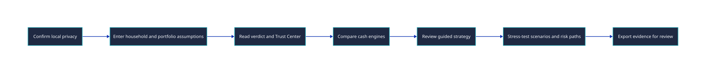

# User Documentation

> Use this library to learn, operate, challenge, and review the Retirement Corpus & Income Planner.

This documentation is written for Indian retirees, family planners, advisers, Chartered Accountants, and evaluators. It is structured so a first-time reader can start with the tutorial, while an experienced reader can jump to a task, concept, reference page, or troubleshooting symptom.

## 0. TL;DR

| Need | Start Here |
|------|------------|
| Open the planner for the first time | [Retirement Planner Quickstart](quickstart.md) |
| Tune a weak or confusing plan | [Tune a Retirement Plan](how-to/tune-retirement-plan.md) |
| Compare Interest, SWP, and IDCW | [Compare Cash Engines](how-to/compare-cash-engines.md) |
| Stress-test the plan | [Stress-test a Retirement Plan](how-to/stress-test-retirement-plan.md) |
| Prepare a professional review pack | [Prepare an Adviser or CA Review Pack](how-to/prepare-adviser-ca-review.md) |
| Understand tax and withdrawal behaviour | [Retirement Tax and Withdrawal Model](concepts/retirement-tax-and-withdrawal-model.md) |
| Understand privacy, saved state, and evidence | [Trust, Privacy, and Evidence](concepts/trust-privacy-and-evidence.md) |
| Understand risk and heatmap colours | [Risk, Simulations, and Heatmap Colours](concepts/risk-simulations-and-heatmap.md) |
| Look up fields and screens | [Assumption Reference](reference/assumptions.md), [Screens and Outputs Reference](reference/screens-and-outputs.md) |
| Something looks wrong | [Troubleshooting](troubleshooting.md) |
| Get support | [Support Map](support.md) |

## 1. Documentation Map

### 1.1 Tutorial

- [Retirement Planner Quickstart](quickstart.md): one first-run path from opening `index.html` to reading a first retirement-readiness verdict and exporting evidence.

### 1.2 How-To Guides

- [Tune a Retirement Plan](how-to/tune-retirement-plan.md): change assumptions safely and keep every output in sync.
- [Compare Cash Engines](how-to/compare-cash-engines.md): decide whether Interest, SWP, or IDCW is the better retirement cash engine for a case.
- [Stress-test a Retirement Plan](how-to/stress-test-retirement-plan.md): use standard scenarios, risk paths, and heatmap evidence before trusting the base case.
- [Prepare an Adviser or CA Review Pack](how-to/prepare-adviser-ca-review.md): hand off PDF, CSV, JSON, assumptions, tax rules, caveats, and evidence.

### 1.3 Reference

- [Assumption Reference](reference/assumptions.md): field meanings, model surfaces, and where each assumption is used.
- [Screens and Outputs Reference](reference/screens-and-outputs.md): pages, drawers, exports, saved state, and review artifacts.
- [Regional and Accessibility Reference](reference/regional-accessibility.md): INR notation, Indian audience expectations, device support, and accessibility posture.

### 1.4 Explanation

- [Retirement Tax and Withdrawal Model](concepts/retirement-tax-and-withdrawal-model.md): SWP, IDCW, slab income, special-rate gains, old units, rebate, and inflation.
- [Trust, Privacy, and Evidence](concepts/trust-privacy-and-evidence.md): local storage, sensitive exports, fingerprints, and professional-review boundaries.
- [Risk, Simulations, and Heatmap Colours](concepts/risk-simulations-and-heatmap.md): End Target Chance, P10/P50/P90, sample count, inflation basis, and heatmap scoring.

### 1.5 Troubleshooting, Release, and Support

- [Troubleshooting](troubleshooting.md): symptoms, causes, diagnostics, remediation, and support-report paths.
- [Support Map](support.md): how to prepare a redacted report when self-service docs do not resolve the problem.
- [2026-05-12 Local-First Planner Release Notes](releases/2026-05-12-charter-compliance.md): user-visible local privacy, Help, export, accessibility, and performance changes.

## 2. Product Journey

The planner is designed as a decision cockpit. The central workflow is:

1. Confirm local privacy posture.
2. Read the first-run tour and Trust Center before relying on saved state or exports.
3. Enter household cash need, corpus, time horizon, tax profile, instrument mix, and risk assumptions.
4. Read the verdict across income, real corpus, end-target confidence, tax drag, and cash stability.
5. Compare cash engines and strategy recommendations.
6. Stress the plan with scenarios, Monte Carlo paths, and heatmap colours.
7. Export evidence for adviser, family, or CA review.

## 3. What The Planner Is Not

The planner is not a filing-grade tax engine, a SEBI-registered investment adviser, a guarantee of market outcomes, a replacement for estate planning, or a product recommendation engine tied to live fund data. Treat the output as planning evidence. Review tax rules, product classification, and large irreversible actions with a qualified professional.

## Revision History

| Version | Revision | Date | Change |
|---------|----------|------|--------|
| 1.0.1 | 2 | 2026-05-18 | Updated support and release-note links to use public-user support language. |
| 1.0.0 | 1 | 2026-05-15 | Added full user-documentation index with Diataxis structure, audience map, journey diagram, screenshots, and trust boundaries. |
