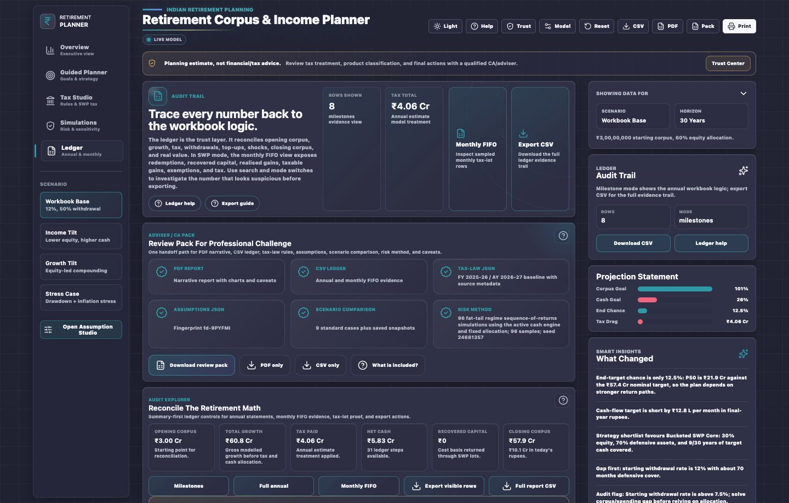

# Prepare an Adviser or CA Review Pack

> Create a review bundle that lets a professional challenge the plan, tax logic, and assumptions.

Use this when you are ready to discuss a retirement plan with a SEBI-registered adviser, Chartered Accountant, or family decision-maker.

## 1. Check The Plan First

Before exporting, read:

- Overview verdict.
- Trust Center.
- Monthly Cash Solver.
- Guided Planner recommendation.
- Tax Studio.
- Simulations.
- Ledger.

Do not export a professional pack while warnings are unresolved unless the purpose is to review those warnings.

## 2. Save A Named Snapshot

Open Saved Scenario Timeline and save the current plan. Add a decision note that explains why this version matters. The snapshot stores assumptions, output summary, tax-law version, source, and fingerprint.

## 3. Confirm Tax Ruleset Provenance

Open Tax Studio and confirm:

- Tax-law version.
- Source URL or source note.
- Update date.
- Ruleset review status.
- Tax regime.
- Age band.
- Residency.
- Section 87A setting.
- Section 80TTB eligibility, if relevant.
- Product classification.

If the ruleset or interpretation is in doubt, mark it for CA review rather than treating the number as final.

## 4. Export The Review Pack

Open Ledger and use Adviser / CA Pack. Keep these artifacts together:

- PDF planning report.
- CSV ledger.
- Tax-law JSON.
- Assumptions JSON.
- Scenario comparison.
- Saved scenario summary.
- Risk method, sample count, seed, and caveats.
- Product and tax provenance.

## 5. Protect The Files

The exports can contain sensitive family or client financial data. Store them in a controlled folder, avoid chat apps for real client data, and remove stale versions after a revised pack is created.

## 6. Give The Reviewer A Question List

Attach the specific questions the reviewer should answer:

- Is the tax profile appropriate for this retiree?
- Are the product classifications correct?
- Does the SWP FIFO result reflect the actual holding pattern?
- Is IDCW being treated too optimistically?
- Does the cash bucket cover poor-return years?
- Is the monthly cash need realistic after healthcare and spouse longevity?
- Is the target corpus sufficient for legacy or late-life care?

## Revision History

| Version | Revision | Date | Change |
|---------|----------|------|--------|
| 1.0.0 | 1 | 2026-05-15 | Added professional review-pack workflow for adviser, CA, and family review. |
