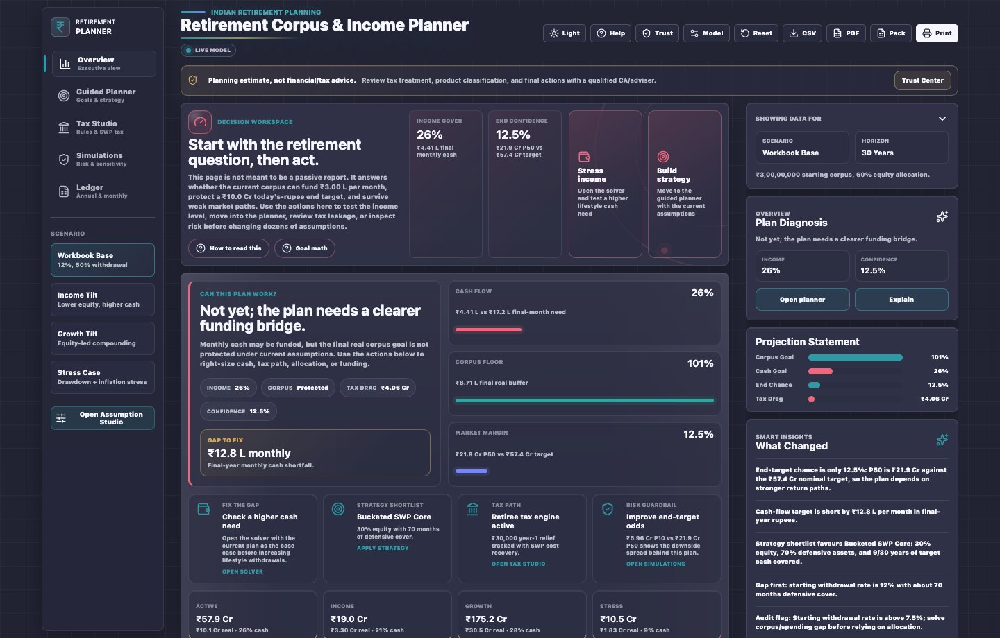
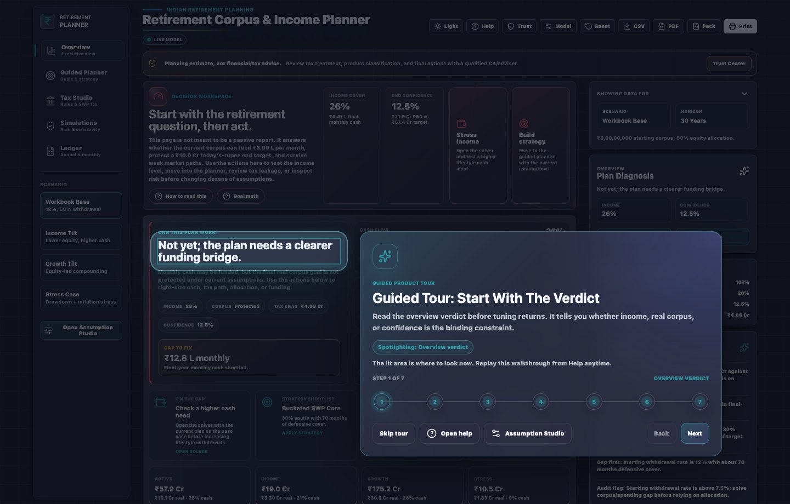

# Retirement Planner Quickstart

> Get from opening the dashboard to a first retirement-readiness answer.

## 1. Open the Dashboard

Open `index.html` in a modern browser. The first screen is the local-data privacy check. Accept it only if this browser profile is safe for remembered assumptions, named scenario history, layout, theme, and tour state. Nothing is uploaded by the app, but real family/client assumptions should not be left in a shared browser. After accepting, the guided tour starts automatically; it is safe to skip and can be restarted from Help later.

## 2. Follow the First-run Tour

The First-run tour walks through the decision flow. Each step spotlights the live section it is explaining and keeps the surrounding app visible, so treat it like a map rather than a slideshow. The tour card uses a compact step rail to show progress and moves around the spotlighted area so the control or section being taught remains readable.

1. Read the overview verdict.
2. Open the Trust Center to understand local storage, model limits, tax provenance, risk sensitivity, exports, and human-review expectations.
3. Set monthly cash, corpus, target corpus, years, inflation, cash engine, and mode.
4. Use Guided Planner and Retiree Guided Mode for the recommended portfolio strategy and household action plan.
5. Audit Tax Studio before trusting tax numbers.
6. Stress the plan in Simulations, including the standard Scenario Library.
7. Export the evidence or use the Adviser / CA Pack for a professional review handoff.

## 3. Use Help As A Reader

Open Help whenever you feel lost. By default, the top reading pane opens to Guided Tutorial so the product map is always visible first. The topic library below is for browsing: choosing a topic expands the full help card in place, so you can read several topics without losing your position in the list.

## 4. Enter the Core Numbers

Use Monthly Cash Solver first. For a retirement plan, start with cash needed per month in today's rupees, corpus today, target corpus today, horizon years, inflation, and cash engine. Then use Retiree Guided Mode when the plan needs to reflect household expenses, pension or rent income, healthcare reserve, dependants, legacy goal, and risk comfort.

## 5. Read the Decision, Not Just the KPI

The dashboard distinguishes income coverage, real corpus protection, market confidence, and tax drag. A nominal final corpus can look good while real purchasing power is weak.

## 6. Save Scenario Snapshots

Use Saved Scenario Timeline on Overview before changing major assumptions. Each snapshot stores the assumptions, output summary, tax-law version, notes, provenance, and a fingerprint so you can compare what changed later.

Use Scenario Library on Simulations when you want standard cases for base, conservative income floor, higher income need, lower return decade, tax-optimised SWP, crash-first-decade, healthcare reserve, sticky inflation, and spouse-longevity planning. Apply makes a case live; Save stores it in the timeline; Export downloads that exact scenario as JSON. The Saved Scenario Timeline can also import a previously exported plan JSON and rebuild its fingerprint/provenance.

## 7. Export the Evidence

Export the evidence only after reviewing the assumptions. CSV is best for the full ledger trail. PDF is best for a branded planning snapshot with KPI summary, visual chart evidence, tax-law provenance, household facts, trust caveats, assumptions fingerprint, and advisor action plan. The PDF is not currently claimed as PDF/UA accessible; use the in-app dashboard, CSV, and JSON pack when accessible machine-readable evidence is required.

For a professional review, open Ledger and use Adviser / CA Pack. It downloads or guides the user through the PDF report, CSV ledger, tax-law JSON, assumptions JSON, scenario comparison, risk method, caveats, and provenance in one handoff flow.

## 8. Clear Saved Data

Use Help > Local Data & Privacy > Clear saved data when you want to remove remembered assumptions, named scenario history, layout, theme, tour state, and the privacy acknowledgement from this browser profile. This does not delete PDF, CSV, JSON, or HTML files already downloaded to disk.

## Revision History

| Version | Revision | Date | Change |
|---------|----------|------|--------|
| 1.6.4 | 12 | 2026-05-15 | Clarified in-place Help topic browsing while preserving the default Guided Tutorial reader. |
| 1.6.3 | 11 | 2026-05-15 | Added Help reader/topic-library navigation guidance. |
| 1.6.2 | 10 | 2026-05-14 | Clarified adaptive guided-tour placement around spotlighted areas. |
| 1.6.1 | 9 | 2026-05-14 | Clarified the compact guided-tour progress rail and spatial coaching behavior. |
| 1.6.0 | 8 | 2026-05-14 | Documented the spatial guided-tour spotlight and added its product screenshot. |
| 1.5.0 | 7 | 2026-05-14 | Expanded Scenario Library guidance, scenario JSON import, and PDF accessibility limitation language. |
| 1.4.0 | 6 | 2026-05-14 | Clarified that privacy consent now leads first launch before the guided tour and before remembered dashboard state. |
| 1.3.0 | 5 | 2026-05-14 | Added Trust Center, Retiree Guided Mode, Scenario Library, and Adviser / CA Pack to the quickstart path. |
| 1.2.0 | 4 | 2026-05-14 | Added saved scenario timeline, fingerprinted export framing, and scenario-history privacy scope. |
| 1.1.0 | 3 | 2026-05-13 | Added first-run privacy notice and Clear saved data guidance. |
| 1.0.1 | 2 | 2026-05-13 | Clarified PDF export now includes branded visual evidence and tax provenance. |
| 1.0.0 | 1 | 2026-05-12 | Added quickstart under the Stribog User Documentation Standard. |
