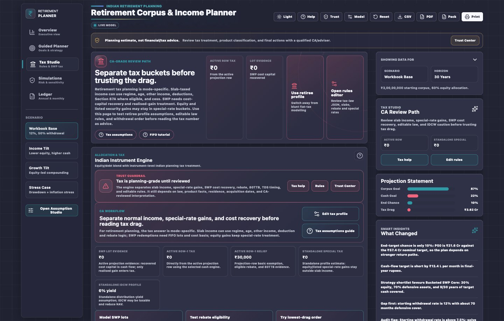
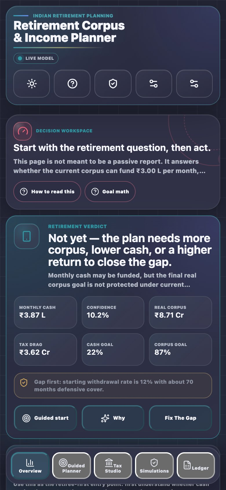

# Assumption Reference

> Reference for the major editable fields in the dashboard, Assumption Studio, Guided Planner, Tax Studio, Simulations, and Ledger.

Assumption reference entries describe what a field means, which model surfaces it affects, and which user-facing outputs should change when the field changes.

## 0. TL;DR

Every visible number should come from the same normalized live plan. If a value is changed in Assumption Studio, Monthly Cash Solver, Tax Studio, Guided Planner, or Simulations, the dashboard, tables, charts, heatmap, exports, and Help context should speak the same effective assumptions.

Monthly cash has an explicit contract: editing it in the Monthly Cash Solver or Assumption Studio switches the live plan to `Monthly target` mode, because users normally expect that amount to drive withdrawals, KPIs, charts, ledger, rail, and exports. If a user manually selects `% interest/distribution`, the cash path is driven by `Interest withdrawn` / withdrawal percentage and monthly cash becomes a benchmark for Cash Goal and solver outputs.

Household planning can replace raw fields with derived effective values. Household spend and income offsets can set the portfolio-funded monthly target; reserves and legacy goals can raise the target corpus; retiree/spouse ages can extend the horizon. Exports use one frozen live snapshot after these effective values are applied.

## 1. Core Retirement Model

| Field | Meaning | Affects |
|-------|---------|---------|
| Starting principal | Investable corpus today | Opening corpus, balance chart, final corpus, real value, allocation math |
| Projection years | Planning horizon; household longevity can override it | All schedules, risk paths, heatmap, solver results |
| Inflation | Rate used to discount future money into today's rupees | Real final value, real cash, heatmap colour basis, target interpretation |
| Annual top-up | Additional yearly contribution | Final corpus, target gap, schedule, tax drag when invested |
| Top-up step-up | Annual increase in top-up | Future corpus and schedule |
| Target corpus today | Desired corpus in today's rupees; household reserves and legacy goals can override it | Corpus goal, End Target Chance, heatmap basis |
| Allow corpus drawdown | Whether the plan may spend principal | Cash engine, depletion warning, solver language |

## 2. Cash Strategy

| Field | Meaning | Affects |
|-------|---------|---------|
| Cash strategy | Interest, SWP, or IDCW cash engine | Tax treatment, ledger, cash goal, final corpus |
| Cash target mode | `% interest/distribution` or monthly target | Withdrawal driver, solver interpretation, warnings, KPI behavior |
| Interest withdrawn | Share of after-tax income withdrawn | Cash, reinvestment, final corpus when `% interest/distribution` mode is selected |
| Monthly cash target | Desired monthly cash in today's rupees unless inflated; household spend and offset income can override it | Live withdrawal path in `Monthly target` mode; Cash Goal and solver benchmark in `% interest/distribution` mode |
| Inflate cash target | Whether monthly cash target grows with inflation | Future cash need and schedule |
| IDCW payout yield | Modelled distribution rate | IDCW cash, NAV drag, tax |

## 3. Return And Allocation

| Field | Meaning | Affects |
|-------|---------|---------|
| Return source | Manual return or equity/debt blend | Annual return used by projections |
| Manual annual return | Single return assumption | Base model when return source is manual |
| Equity allocation | Equity share | Blended return, risk, tax mix, strategy guidance |
| Equity return | Expected equity return | Blended return, scenario comparison |
| Debt return | Expected debt return | Blended return, income floor, tax |
| Expense/advisory drag | Annual drag on return | Effective yield and final corpus |
| Compounding | Annual or monthly compounding setting where applicable | Effective yield |

## 4. Instruments And Product Classification

| Field | Meaning | Affects |
|-------|---------|---------|
| Equity instrument | Equity MF, ETF, listed equity, or related class | LTCG/STCG, exemption use, holding period |
| Debt instrument | Debt MF, FD, G-sec, T-bill, listed bond, or related class | Slab tax, listed bond treatment, 80TTB eligibility |
| Cost basis in old units | Portion of existing holding treated as recoverable cost | SWP cost recovery and realised gain |
| Existing holding age | Age of current units | LTCG/STCG classification |
| SWP redemption order | Lot sale order | FIFO ledger, tax, recovered capital |

## 5. Retiree Tax Profile

Retiree tax profile fields determine how slab-rate income, relief, residency, and product classification enter the planning tax estimate.

| Field | Meaning | Affects |
|-------|---------|---------|
| Tax model | Retiree profile or legacy flat-tax stress | Tax calculation method |
| Tax regime | New or old regime | Slab bands, rebate, deductions |
| Age band | Below 60, senior, super-senior | Basic exemption and senior relief eligibility |
| Residential status | Resident or non-resident | Rebate, withholding, assumptions |
| Other taxable income | Non-portfolio income entering slab tax | Rebate and slab tax |
| Pension or salary-like income | Retirement income that can affect slab profile | Tax profile and household plan |
| Standard deduction | Deduction where eligible | Slab taxable income |
| Section 87A rebate | Active interpretation for eligible slab income | Slab tax relief |
| Manual all-tax override | Stress override for all tax | Bypasses detailed retiree profile when used |
| Tax-law ruleset | Editable JSON rules used by tax engine | All tax-sensitive calculations |

## 6. Household Plan

| Field | Meaning | Affects |
|-------|---------|---------|
| Essential spend | Minimum monthly household need | Guided Planner and cash target |
| Discretionary spend | Flexible monthly spend | Guided Planner and bad-market response |
| Pension/rent/annuity income | Non-portfolio monthly income offsets | Portfolio-funded cash need |
| Healthcare reserve | Planned reserve outside or inside target | Target corpus and action plan |
| Dependants | Household support burden | Strategy guidance |
| Retiree and spouse ages | Longevity framing | Plan horizon and household guidance |
| Legacy goal | Corpus preservation objective | Strategy score and target |

## 7. Risk And Simulation

| Field | Meaning | Affects |
|-------|---------|---------|
| Annual volatility | Portfolio volatility for sampled paths | End Target Chance, P10/P50/P90 |
| Equity volatility | Equity component volatility | Risk paths when blend is active |
| Debt volatility | Debt component volatility | Risk paths when blend is active |
| Equity/debt correlation | Relationship between asset return paths | Monte Carlo paths |
| Risk runs | Number of sampled paths | Confidence band and responsiveness |
| Risk seed | Repeatable sampled path seed | Reproducibility |
| Shock model | None, fixed shock, fat-tail regime, or related mode | Downside paths |
| Shock year | Year in which fixed shock occurs | Risk path and schedule |
| Shock drawdown | Size of fixed shock | Risk path and schedule |
| Glide path | Fixed allocation or changing equity path | Long-term risk mix |

## 8. Saved Scenario History

Saved Scenario Timeline stores named snapshots in browser storage. A snapshot includes assumptions, notes, output summary, active tax-law version, source, library id when applicable, export provenance, and a fingerprint.

Scenario Library cases are standard starters for base, conservative income floor, higher income need, lower return decade, tax-optimised SWP, crash-first-decade, healthcare reserve, sticky inflation, and spouse-longevity planning.

## 9. Trust And Review Outputs

The Trust Center explains local storage, model limits, tax-law status, risk method, export sensitivity, and human-review guidance. The Adviser / CA Pack contains PDF, CSV, tax-law JSON, assumptions JSON, scenario comparison, saved scenario summary, risk method/seed, caveats, and provenance.

## 10. Mobile Review Mode

On phone-sized screens, the app prioritizes verdict, key actions, and review cards. Dense tables remain better suited to tablet or desktop review.

## 11. Dynamic Withdrawal, Goals, Rebalancing, And Backtest

| Field | Meaning | Default | Affects |
|-------|---------|---------|---------|
| Withdrawal rule | Fixed, Guardrails, or % of corpus | Fixed | How the recurring annual cash need is resolved each year |
| Guardrail band | How far the withdrawal rate must drift before a Guardrails cut or raise fires | 20% | Guardrails cut/raise trigger |
| Guardrail adjustment | Size of a Guardrails cut or raise | 10% | Guardrails spending multiplier |
| % of corpus rate | Percentage of opening corpus recomputed as the yearly target | 5% | % of corpus withdrawal target |
| Spending floor | Minimum monthly cash (today's rupees) that either dynamic rule will not fall below | ₹0 (no floor) | Guardrails and % of corpus resolved target |
| Planned lump-sum goals | Up to 10 named one-time goals, each with its own amount, year, and inflation setting | None | Target cash in each goal's own year; replaces the legacy single planned lump sum, which still loads automatically into this list |
| Tax-aware rebalancing | Whether the SWP engine's annual equity/debt rebalancing realises capital gains/losses on the selling leg | Off | Rebalance tax, realised gain, and the capital-loss carry-forward pool |
| Backtest lab | Whether the Historical Backtest Lab computes cohort results | On | Simulations Backtest Lab card |
| Historical rate | Whether the backtest replays each cohort's own historical inflation instead of your assumed rate | Off | Backtest cash targets and real-corpus values |

Capital-loss carry-forward (8-assessment-year FIFO expiry under Section 74) has no toggle — it is always applied inside the SWP and Interest engines once a loss is realised. See [Retirement Tax and Withdrawal Model](../concepts/retirement-tax-and-withdrawal-model.md) for the full explanation of these fields.

## Revision History

| Version | Revision | Date | Change |
|---------|----------|------|--------|
| 2.3.0 | 10 | 2026-07-06 | Added reference entries for withdrawal rule, guardrail band/adjustment, % of corpus rate, spending floor, planned lump-sum goals, tax-aware rebalancing, and backtest fields (v2.0.0); noted always-on capital-loss carry-forward. |
| 2.2.0 | 9 | 2026-05-16 | Added effective-assumption reconciliation notes for household overrides, export snapshots, and stable percent-withdrawal projections. |
| 2.1.0 | 8 | 2026-05-16 | Clarified monthly-cash contract: direct edits switch to Monthly target mode; percent mode uses withdrawal percentage as the driver. |
| 2.0.0 | 7 | 2026-05-15 | Rebuilt assumption reference with core, cash, return, instrument, tax, household, risk, scenario, trust, and mobile sections. |
| 1.4.0 | 6 | 2026-05-14 | Expanded Scenario Library cases and documented scenario JSON import provenance. |
| 1.3.0 | 5 | 2026-05-14 | Added Retiree Guided Mode, Scenario Library provenance, Trust Center, and Adviser / CA Pack assumptions. |
| 1.2.0 | 4 | 2026-05-14 | Added End Target Chance interpretation, saved scenario history, Tax Law Studio safeguards, and mobile review-mode assumptions. |
| 1.1.0 | 3 | 2026-05-13 | Added PMVVY household offset and NRI withholding timing references. |
| 1.0.1 | 2 | 2026-05-13 | Added Section 80TTB and conservative 87A assumption language. |
| 1.0.0 | 1 | 2026-05-12 | Added assumption reference. |
