# Regional Accessibility Reference

> Reference for Indian audience assumptions, device support, language posture, and accessibility expectations.

## 1. Indian Money View

The dashboard uses Indian rupee, lakh, and crore notation by default because the product is built for Indian retirement planning. Real values are shown in today's rupees after inflation adjustment.

## 2. Current Language Scope

The maintained product language is English with Indian financial terminology. The first regional-language slice is a Hindi/English glossary inside Help.

## 3. Hindi Glossary Pilot

Open Help and choose **Hindi Retirement Glossary Pilot** when family members or retirees need familiar Hindi terms before reading detailed tax/model language.

The pilot explains core terms such as corpus, monthly cash, inflation, cash bucket, SWP, LTCG, STCG, rebate, and TDS. It is an orientation layer. The model, tax-law JSON, exports, and CA-review language remain in English for precision and auditability.

## 4. Device Support

The product is expected to work on desktop, narrow desktop, tablet, Android-sized mobile viewports, and iPhone-sized mobile viewports. The mobile experience is treated as a first-class planning surface, not as a squeezed desktop dashboard. On phone screens, the app uses compact product identity, bottom navigation, sheet-based insights, safe-area spacing, and tap targets suitable for touch.

Mobile is suitable for review, guided planning, light tuning, Help, scenario reading, and sharing. Deep ledger and CA review are still better on tablet or desktop unless the workflow has a dedicated mobile card/detail view.

The phone shell is tested on both iPhone-class and Android-class viewport sizes. The top action dock uses five equal-width touch cells for theme, Help, Trust, Model, and More; each icon is centered inside the tap target and the bottom navigation remains the primary page switcher.

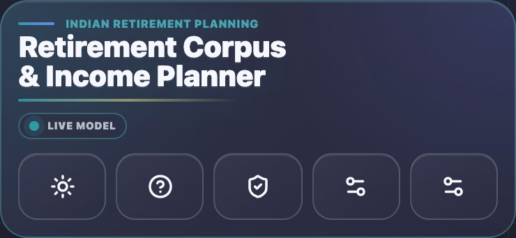

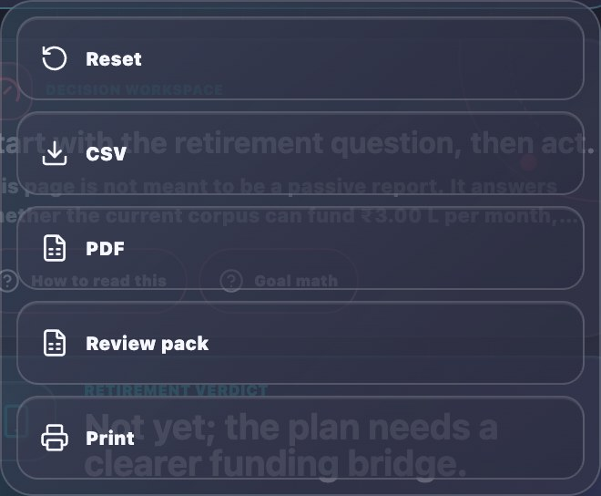

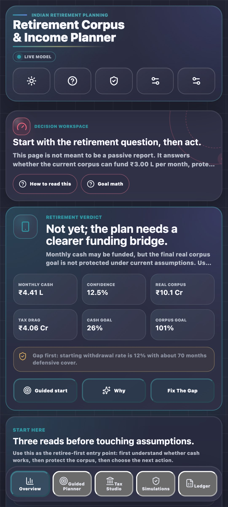

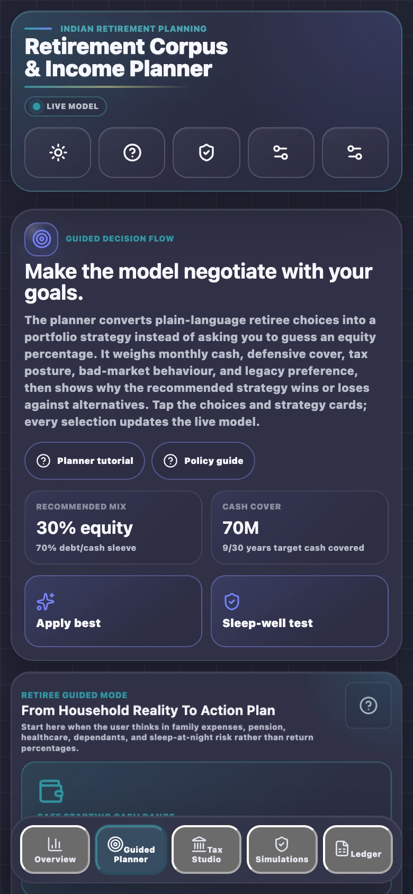

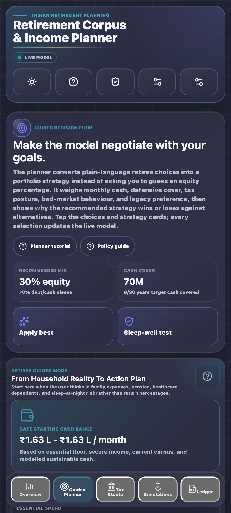

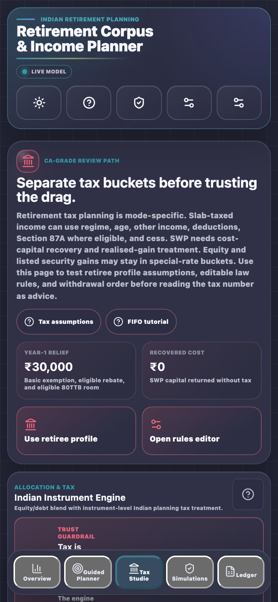

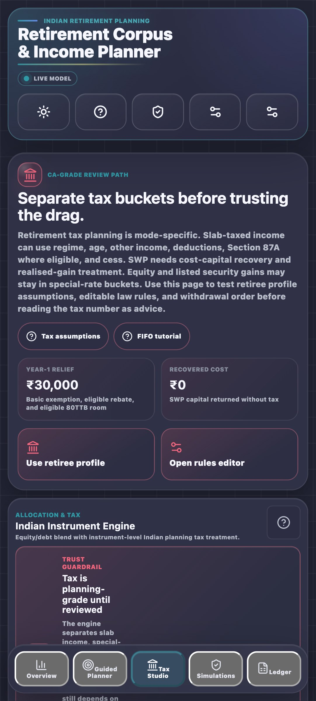

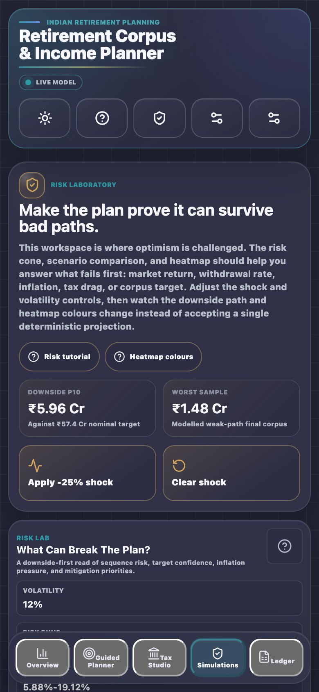

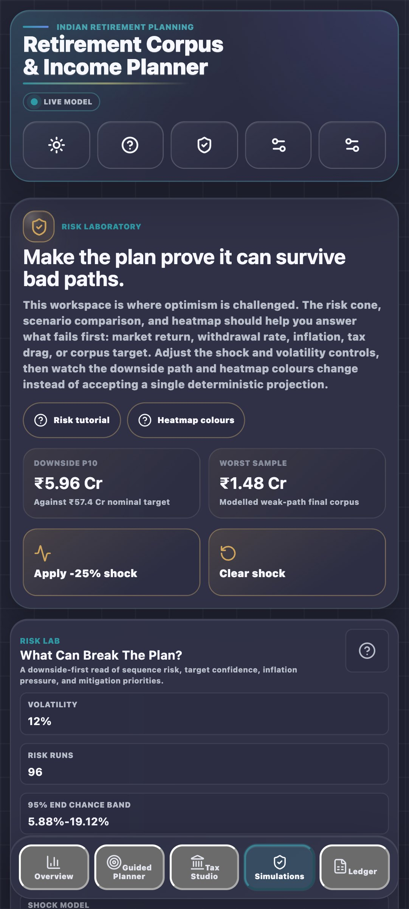

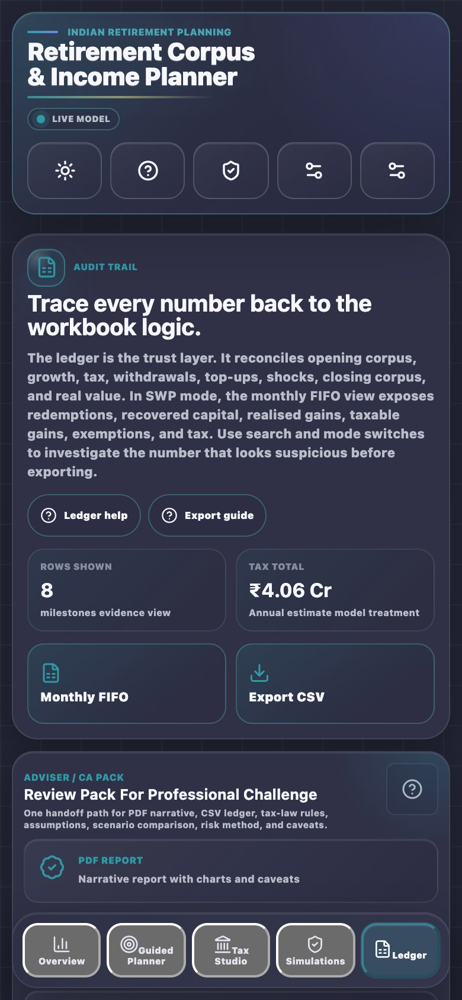

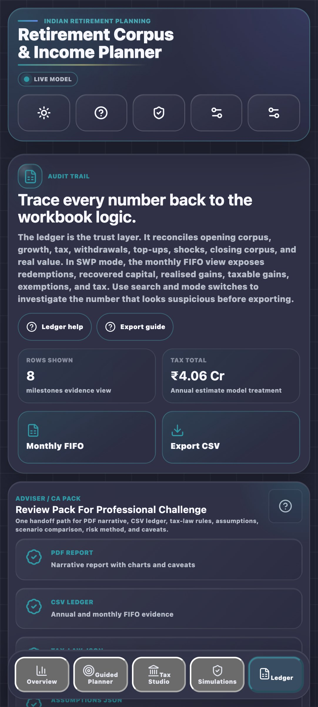

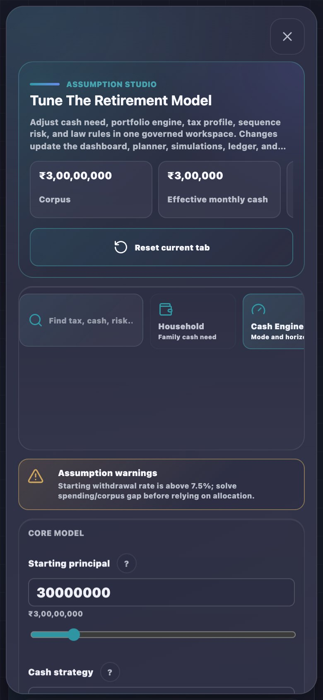

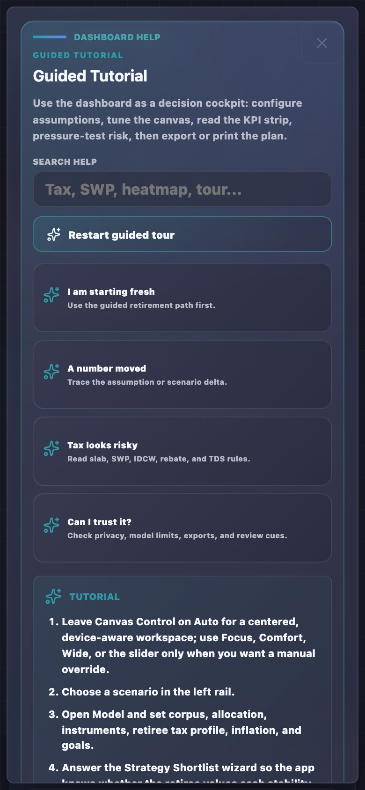

## 5. Accessibility Posture

The UI targets WCAG 2.2 AA through accessible labels, keyboard-visible controls, contrast gates, reduced-motion handling, forced-colors support, and automated axe checks. Automated WCAG 2.2 AA axe checks pass as part of the release gate. A known open item (Charter round 3 audit, fin-chrt.04–.06) is that the color palette is constructed in sRGB rather than a perceptual color space (OKLCH/OKLab), and CVD (colour vision deficiency) simulation verification is not yet automated. These gaps do not affect screen-reader or keyboard accessibility but may affect perceptual contrast under some color vision profiles. PDF output is not currently claimed as PDF/UA accessible.

## 6. Future Localization Plan

Future regional support should be added in controlled slices:

- Configurable INR display density for full rupee values versus lakh/crore shorthand.
- Hindi glossary expansion for all KPI, tax, and export terms.
- Marathi glossary pilot after Hindi terminology stabilizes.
- Glossary search synonyms for common Indian financial phrases.
- Screenshots and manual usability checks with retiree/family users.
- Export language review if PDF/CSV are localized.

## Revision History

| Version | Revision | Date | Change |
|---------|----------|------|--------|
| 1.1.5 | 7 | 2026-05-18 | Added Charter round 3 audit caveat to §5 Accessibility Posture: WCAG 2.2 AA axe gate passes but CVD/palette gaps (fin-chrt.04–.06) are open items that may affect perceptual contrast under some color vision profiles. |
| 1.1.4 | 6 | 2026-05-16 | Added Android-class Guided Planner, Tax Studio, Simulations, and Ledger screenshot references to the mobile evidence section. |
| 1.1.3 | 5 | 2026-05-16 | Added exact mobile topbar/menu, simulations, ledger, Assumption Studio, and Help screenshot evidence. |
| 1.1.2 | 4 | 2026-05-16 | Added Android-class mobile evidence and mobile action-dock behavior. |
| 1.1.1 | 3 | 2026-05-15 | Clarified mobile-first device support and phone-native shell expectations. |
| 1.1.0 | 2 | 2026-05-15 | Expanded regional reference with Indian money view, device support, accessibility posture, and localization roadmap. |
| 1.0.0 | 1 | 2026-05-14 | Added regional accessibility reference and Hindi glossary pilot documentation. |
