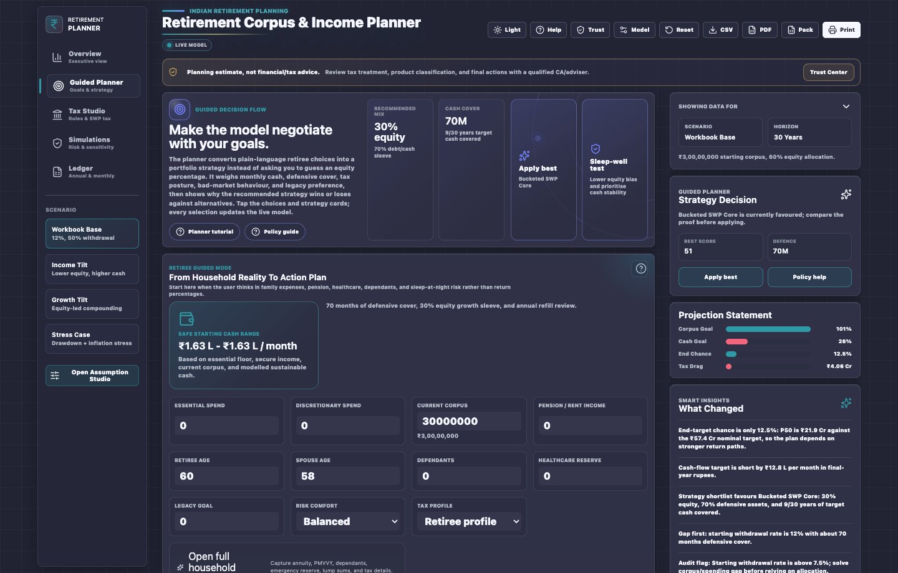
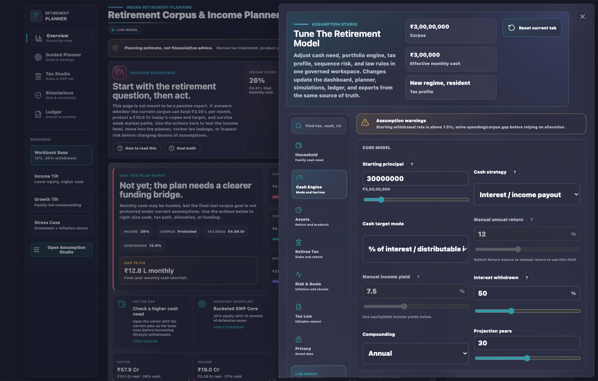

# Screens and Outputs Reference

> Reference for the visible app surfaces and downloadable outputs.

## 1. Pages

| Page | Purpose | Primary Outputs |
|------|---------|-----------------|
| Overview | Decision cockpit, Trust Center, monthly solver, saved scenario timeline | Verdict, KPIs, solver output, scenario snapshots |
| Guided Planner | Goal and strategy workspace | Recommended strategy, household action plan, withdrawal policy |
| Tax Studio | Tax assumptions and ruleset review | Tax breakdown, SWP/IDCW facts, editable ruleset status |
| Simulations | Stress testing | Scenario Library, risk cone, heatmap, downside paths |
| Ledger | Evidence and exports | Annual schedule, monthly FIFO trail, PDF, CSV, review pack |

Phone evidence is captured separately because the mobile experience is not a compressed desktop grid. Overview, Guided Planner, Tax Studio, Simulations, Ledger, Help, and Assumption Studio are audited as mobile-first review surfaces.

## 2. Modals And Drawers

| Surface | Purpose |
|---------|---------|
| Assumption Studio | Full model configuration with search, warning strips, and tax-law controls |
| Help | Guided tutorial, topic library, context coach, and local-data controls |
| Trust Center | Privacy, tax provenance, model limits, risk method, and export sensitivity |
| Guided Tour | First-run product walkthrough and replayable spatial coach |

## 3. Downloads

| Output | Use | Contains |
|--------|-----|----------|
| PDF | Planning narrative | KPIs, chart evidence, caveats, tax-law provenance, fingerprint, adviser action plan |
| CSV | Ledger audit | Metadata, assumptions, tax ruleset, risk method, annual rows, monthly FIFO rows |
| Scenario JSON | Scenario portability | Saved snapshot assumptions, summary, notes, source, fingerprint |
| Tax-law JSON | Tax rule audit | Active ruleset, source metadata, slab/special-rate rules, version |
| Adviser / CA Pack JSON | Professional review | Caveats, assumptions, tax-law JSON, scenario comparison, saved scenarios, risk summary, CSV text |

## 4. Stored Browser State

The app can store assumptions, scenario history, layout, theme, guided-tour status, tax-law edits, and privacy consent in the current browser profile. Use Help > Local Data & Privacy when that state should be cleared.

## 5. Generated HTML

Open or ship `index.html` or `Retirement Corpus & Income Planner.html`. The build also writes `dist/app.html` and `dist/index.html` as generated artifacts. Do not edit those files by hand.

## Revision History

| Version | Revision | Date | Change |
|---------|----------|------|--------|
| 1.2.0 | 3 | 2026-05-16 | Expanded mobile screenshot evidence to all primary pages, topbar actions, Help, and Assumption Studio. |
| 1.1.0 | 2 | 2026-05-16 | Added mobile Overview, Guided Planner, and Tax Studio screenshots to the screen reference. |
| 1.0.0 | 1 | 2026-05-15 | Added reference for pages, drawers, downloads, browser state, and generated HTML artifacts. |
