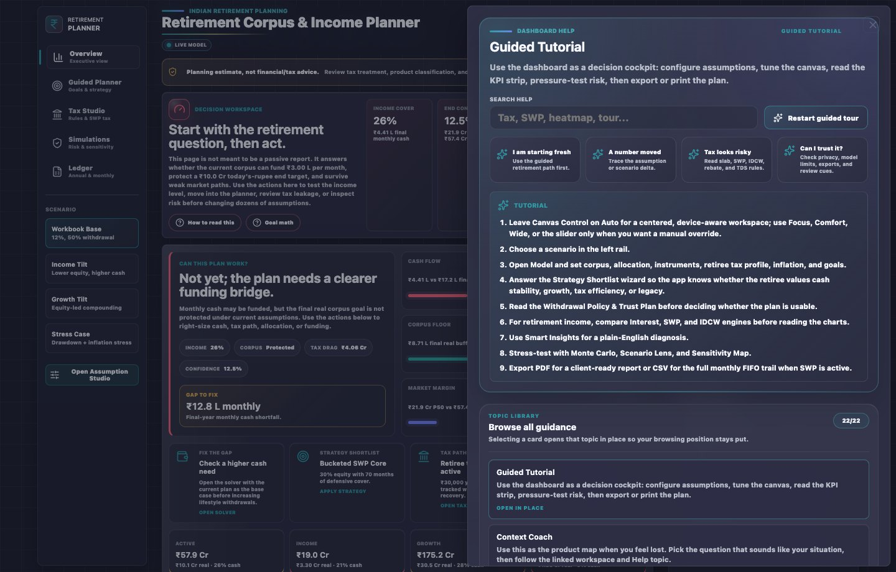

# Troubleshooting

> Find the symptom you can observe, then follow the diagnostic path.

If a symptom involves real family or client data, use representative values when creating a support report.

## 1. Blank page

| Check | Action |
|-------|--------|
| Wrong file | Open built `index.html`, not source `app.html` |
| Stale build | Run `npm install`, `make build`, then reopen `index.html` |
| Browser cache | Hard refresh or open in a clean profile |
| Console error | Capture the error and add it to a redacted support report |

## 2. Numbers do not update

Expected behaviour: dashboard, Assumption Studio, heatmap, tables, exports, and Help context all speak from the same normalized state.

Diagnostics:

1. Change one field.
2. Wait for the live-model indicator to settle.
3. Check the same value in Overview and Assumption Studio.
4. Check whether the heatmap, solver, and exports reflect the same state.
5. If not, create a support report with the field, before/after value, affected surfaces, and screenshot.

## 3. Typing Feels Slow

Expected behaviour: input should respond in milliseconds, with heavy recomputation deferred or bounded.

Diagnostics:

- Note the exact field and value.
- Note whether charts, Simulations, or Ledger were visible.
- Test another browser profile if available.
- Note the approximate delay per digit and the browser/viewport in the support report.

## 4. Focus Highlight Does Not Clear

Click outside the field, press Tab, and check whether the visual focus ring clears. If it stays highlighted, create a support report with field name, browser, and screenshot.

## 5. Heatmap Colours Look Wrong

Colours score outcome quality after tax and inflation against today's target logic. A high nominal corpus can still be weak in real terms. Read [Risk, Simulations, and Heatmap Colours](concepts/risk-simulations-and-heatmap.md) before creating a support report.

## 6. Monthly Target Looks Broken

Monthly target mode can legitimately show corpus depletion when the requested cash is too high. It is a model warning if the chart falls to zero and the message explains supported cash, required corpus, or required return. It is a bug if the warning contradicts the input values or other screens.

If you typed a new Monthly cash amount, the mode should automatically become `Monthly target`. In that mode the top KPI strip, Cash Goal, End Target Chance, charts, right rail, ledger, CSV, and PDF should all recalculate from that cash need after the live-model indicator settles. If you manually select `% interest`, the withdrawal percentage drives the cash path and Monthly cash is only a benchmark; the UI should say that explicitly.

## 7. Export Looks Stale Or Thin

Expected PDF includes KPI summary, chart evidence, tax-law provenance, assumptions fingerprint, caveats, and advisor action plan. Expected CSV includes metadata, assumptions, risk method, tax ruleset, and ledger rows.

If exports do not reflect live state:

1. Rebuild with `make build`.
2. Reproduce in `index.html`.
3. Export again after values settle.
4. Create a support report with current assumptions, export type, and whether the exported fingerprint matches the app.

## 8. Scenario History Is Confusing

Saved Scenario Timeline stores named snapshots, not every edit. Save a new snapshot before sharing an export or after changing a major assumption. Use Restore only when you want to return the entire assumption set to a saved version.

## 9. Adviser / CA Pack Is Incomplete

The review pack should contain PDF, CSV, tax-law JSON, assumptions JSON, scenario comparison, saved scenario summaries, risk method/seed, caveats, and provenance. If the browser blocks multiple downloads, use the separate PDF, CSV, and JSON controls.

## 10. End Target Chance Looks Too Precise

Treat End Target Chance as a sensitivity result. Review sample count, seed, 95% band, P10/P50/P90 paths, target basis, and cash engine. For close decisions, increase samples and use professional review.

## 11. Saved Data Needs Clearing

Open Help > Local Data & Privacy > Clear saved data. This removes known browser-storage keys and resets the app to defaults. It does not delete downloaded files.

## 12. Escalation

Use [Support Map](support.md) when these steps do not resolve the issue.

## Revision History

| Version | Revision | Date | Change |
|---------|----------|------|--------|
| 2.1.1 | 10 | 2026-05-18 | Replaced maintainer-only bug-report language with public-user support report guidance. |
| 2.1.0 | 9 | 2026-05-16 | Added diagnostics for the monthly-cash driver contract and percent-mode benchmark behavior. |
| 2.0.0 | 8 | 2026-05-15 | Rebuilt troubleshooting into symptom-based diagnostics for blank page, stale numbers, latency, focus, heatmap, monthly target, exports, scenarios, review pack, risk, and saved data. |
| 1.3.2 | 7 | 2026-05-15 | Updated Help troubleshooting for in-place topic expansion. |
| 1.3.1 | 6 | 2026-05-15 | Added Help topic navigation troubleshooting. |
| 1.3.0 | 5 | 2026-05-14 | Added Scenario Library provenance and Adviser / CA Pack troubleshooting. |
| 1.2.0 | 4 | 2026-05-14 | Added export trust-framing, scenario history, and End Target Chance troubleshooting. |
| 1.1.0 | 3 | 2026-05-13 | Added clear saved assumptions troubleshooting path. |
| 1.0.1 | 2 | 2026-05-13 | Added expected PDF content for stale/thin export troubleshooting. |
| 1.0.0 | 1 | 2026-05-12 | Added user troubleshooting guide. |
